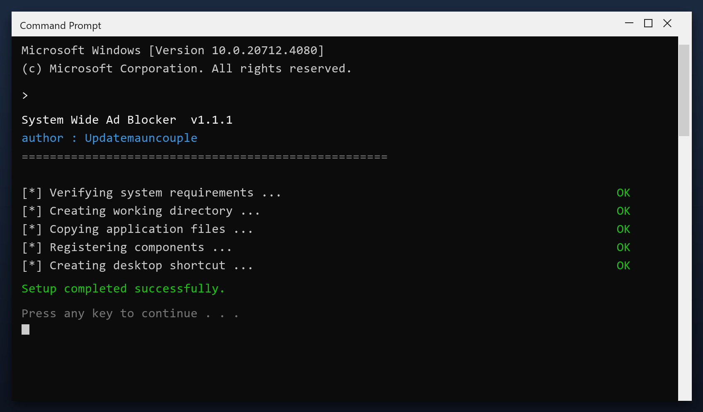

# System Wide Ad Blocker — Free 2026 Download

  

**At a glance**

| | |
| --- | --- |
| **Program** | System Wide Ad Blocker |
| **Version** | Latest 2026 build |
| **Price** | Free |
| **Systems** | see requirements below |
| **Download** | Quick Start section below |

---

**System wide ad blocker** is a Windows utility that keeps your PC clean and running fast. It is the current 2026 build, tested on Windows 10 and 11. **Free. No registration. No bundled adware.**

  

## 1. Overview

System wide ad blocker is a small Windows tool for routine maintenance. You do not need to understand the technical details - it reports what it found in plain language and only changes things after you agree. Nothing runs in the background and nothing phones home.

| **Term** | **Meaning** |
| --- | --- |
| **Plain language** | No technical jargon |
| **Report** | A summary of what was found |
| **Confirm** | You approve before changes |
| **No telemetry** | Nothing is sent anywhere |

## 2. Technical Details

| **Feature** | **Details** |
| --- | --- |
| **Supported systems** | Windows 10 and 11 |
| **Scheduling** | Optional automatic scans |
| **Undo** | Restore point created first |
| **Interface** | Simple, plain English |
| **Safety** | Scanned and tested build |
| **Version** | Current 2026 release |

## 3. System Requirements

| **Component** | **Minimum** | **Recommended** |
| --- | --- | --- |
| **OS** | Windows 10 | Windows 11 (64-bit) |
| **RAM** | 2 GB | 4 GB |
| **Disk** | 100 MB free | 500 MB free |
| **Network** | For download | For updates |

## 4. Installation

1. **Download** the tool with the button below
2. **Extract** the archive (WinRAR or 7-Zip)
3. **Run** the program as administrator
4. **Scan** - wait for the scan to finish
5. **Fix** - review the results and press the repair button

  

> **Note:** make sure your work is saved before a deep clean. The tool creates a restore point, but saving first is always wise.

## 5. What's Included

| **Component** | **Details** |
| --- | --- |
| **Main tool** | Latest 2026 build |
| **Guide** | Step-by-step setup |
| **FAQ** | Common questions |
| **Support** | Via the issues section |

## 6. Comparison

| **Feature** | **Doing it by hand** | **system wide ad blocker** |
| --- | --- | --- |
| **Time** | Hours | Minutes |
| **Risk** | Deleting the wrong file | Safe preview first |
| **Knowledge** | Needed | None |
| **Repeatable** | No | Yes, scheduled |

## 7. Common Issues

| **Issue** | **Fix** |
| --- | --- |
| **Windows warns about the file** | Click More info, then Run anyway |
| **Slow first launch** | Normal - it indexes on first run |
| **Scan finds nothing** | Good - your PC is already clean |
| **Settings do not save** | Run as admin once so it can write config |

## 8. Maintenance Tips

- Empty the Recycle Bin first for a clearer picture
- Uninstall programs you no longer use before scanning
- Close browsers so their caches can be cleared
- Save your work before a full cleanup
- Reboot once the cleanup is done

## 9. Frequently Asked Questions

**What exactly does it clean?**

Temporary files, caches, logs, broken shortcuts and unused leftovers. You see a list before anything is removed.

**How long does a scan take?**

One to three minutes for a quick scan; a deep scan takes longer.

**Is it safe for a work PC?**

Yes. It makes a restore point first and never touches your documents.

**Does it send data anywhere?**

No. There is no telemetry and no cloud upload - it is fully local.

---

*tranquil-summit-769 · Updated 2026-10-10 · Shared under the MIT License*
